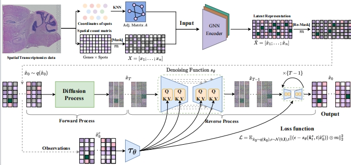






<!-- 标题 -->
### Dimensionality Reduction and Denoising of Spatial Transcriptomics Data Using Dual-channel Masked Graph Auto-encoder [[GitHub](https://github.com/donghaifang/STMask/tree/main)]
### 摘要
We propose an efficient self-supervised learning method utilizing a **dual-channel masked graph autoencoder**  for the analysis and research of spatial transcriptomics data (namely **STMask**). The gene representation learning channel cleverly integrates the masking mechanism into the graph autoencoder, reducing feature redundancy and enhancing model robustness. Additionally, we employ the scaled cosine loss as the training objective to further stabilize the embedding representation. Simultaneously, the gene relationship learning channel disrupts the spatial graph structure to generate multiple perspectives and combines contrastive learning principles to maximize mutual information, thereby strengthening the model's discriminative capability. It is worth noting that the two channels share the same encoder, which helps to enhance the model's ability to learn gene expressions and facilitates the acquisition of discriminative feature embeddings...
<!-- 论文模型图 -->

 
  
<!-- -->

### 论文状态
- 投稿PLoS CB 2024.5 
- [BioRxiv](https://www.biorxiv.org/content/10.1101/2024.05.30.596562v1)

### 论文引用

The corresponding BiBTeX citation are given below:

<pre>
@article{STMask2024,
author       = {Wenwen Min, Donghai Fang Jinyu Chen and Shihua Zhang},
title        = {Dimensionality Reduction and Denoising of Spatial Transcriptomics Data Using Dual-channel Masked Graph Auto-encoder},
year         = {2024}
}
</pre>

--------------------------------------------------------------

<!-- 标题 -->
### Masked Conditional Diffusion Model with GNN for Spatial Transcriptomics Data Imputation [[GitHub](https://github.com/lllxxyyy-lxy/stMCDI)]
### 摘要
Spatially resolved transcriptomics represents a significant advancement in single-cell analysis by offering both gene expression data and their corresponding physical locations. 
However, this high degree of spatial resolution entails a drawback, as the resulting spatial transcriptomic data at the cellular level is notably plagued by a high incidence of missing values.
Furthermore, most existing imputation methods either overlook the spatial information between spots or compromise the overall gene expression data distribution.
To address these challenges, our primary focus is on effectively utilizing the spatial location information within spatial transcriptomic data to impute missing values, while preserving the overall data distribution.
We introduce \textbf{stMCDI}, a masked conditional diffusion model for spatial transcriptomics data imputation, which employs a denoising network trained using randomly masked data portions as guidance, with the unmasked data serving as conditions. 
Additionally, it utilizes a GNN encoder to integrate the spatial position information, thereby enhancing model performance.
Compared with baseline methods, our model achieves state-of-the-art performance in all evaluation metrics on six real-world datasets.
The results obtained from spatial transcriptomics datasets elucidate the performance of our methods relative to existing approaches.
Our code can be accessed at \url{https://anonymous.4open.science/r/stMCDI-2824}.
<!-- 论文模型图 -->

 

### 论文状态
- 投稿TNNLS 2024.4 
- [arXiv](https://arxiv.org/abs/2403.10863)

### 论文引用

The corresponding BiBTeX citation are given below:

<pre>
@article{li2024stmcdi,
  title={stMCDI: Masked Conditional Diffusion Model with Graph Neural Network for Spatial Transcriptomics Data Imputation},
  author={Li, Xiaoyu and Min, Wenwen and Wang, Shunfang and Wang, Changmiao and Xu, Taosheng},
  journal={arXiv preprint arXiv:2403.10863},
  year={2024}
}

</pre>

--------------------------------------------------------------

<!-- 标题 -->
### Multimodal attention-based variational autoencoder for clinical risk prediction [[GitHub](https://github.com/wenwenmin/MAVAE)]
### 摘要
Prediction of survival risk in cancer patients is crucial for understanding the underlying mechanisms of canceration in different stages. 
Previous studies mainly relied on single-modal omics data due to  technological constraints. 
However, with the increasing availability of cancer omics data, researchers have focused on the use of multi-omics and multimodal data for survival analysis. 
The application of deep learning methods has become an option for the prediction of clinical risk.
Recent advances in the attention mechanism and the variational autoencoder (VAE) have made them promising for analyzing cancer omics data. 
However, VAE has limitations in disregarding the importance of different features between modalities, and the introduction of an attention mechanism could address this limitation. 
In this study, we propose a Multimodal Attention-based VAE (MAVAE) deep learning framework using cross-modal multihead attention to integrate cancer multi-omics data for clinical risk prediction. 
We evaluated our approach on eight TCGA datasets.
We find that 
(1) MAVAE outperforms traditional machine learning and recent deep learning methods; 
(2) Multi-modal data yields better classification performance than single-modal data; 
(3) The multi-head attention mechanism improves the decision-making process; 
(4) Clinical and genetic data are the most important modal data.
<!-- 论文模型图 -->

 

### 论文状态
- BIBM2023 

### 论文引用

The corresponding BiBTeX citation are given below:

<pre>
@inproceedings{li2023multimodal,
  title={Multimodal attention-based variational autoencoder for clinical risk prediction},
  author={Li, Xiaoyu and Xu, Taosheng and Chen, Jinyu and Wan, Jun and Min, Wenwen},
  booktitle={2023 IEEE International Conference on Bioinformatics and Biomedicine (BIBM)},
  pages={1260--1265},
  year={2023},
  organization={IEEE}
}

</pre>

---
title: "TransVCOX"
collection: software
permalink: /software/TransVCOX
date: 2024-06-04
---

<!-- 标题 -->
### TransVCOX: Bridging Transformer Encoder and Pre-trained VAE for Robust Cancer Multi-Omics Survival Analysis[[GitHub](https://github.com/wenwenmin/TransVCOX)]
### 摘要
Traditional survival analysis models, such as the COX proportional hazards model, face challenges in processing multimodal data, identifying nonlinear relationships, and recognizing complex data patterns. The rise of deep learning, particularly Transformers and variational autoencoders (VAEs), has showcased its potential in analyzing cancer multi-omics data comprehensively. However, many individual cancer datasets suffer from limited sample sizes, preventing some deep learning models from extracting in-depth data representations and resulting in subpar performance.
To address this issue, we advocate the adoption of pre-training and fine-tuning techniques, which effectively mitigate performance deficits due to sparse cancer data samples. We introduce TransVCOX, a deep survival analysis model integrating a Transformer encoder with VAE. This model leverages pre-training and fine-tuning approaches to predict patients' survival risk using cancer multi-omics data.
Rigorous tests on eight unique cancer datasets from TCGA revealed:
(1) TransVCOX outperforms other deep learning and conventional COX models.
(2) Pre-training significantly reduces model overfitting and enhances performance.
(3) VAE encoding, compared to positional encoding, offers a richer decision-making foundation.
(4) The performance boost doesn't linearly correlate with the addition of Transformer blocks.
These findings underline TransVCOX's promising capability for predicting cancer patients' survival risks using multi-omics data. 
<!-- 论文模型图 -->

 

### 论文状态
- BIBM2023 

### 论文引用

The corresponding BiBTeX citation are given below:

<pre>
@inproceedings{li2023transvcox,
  title={TransVCOX: Bridging Transformer Encoder and Pre-trained VAE for Robust Cancer Multi-Omics Survival Analysis},
  author={Li, Xiaoyu and Min, Wenwen and Chen, Jinyu and Wu, Jiaxin and Wang, Shunfang},
  booktitle={2023 IEEE International Conference on Bioinformatics and Biomedicine (BIBM)},
  pages={1254--1259},
  year={2023},
  organization={IEEE}
}

</pre>

