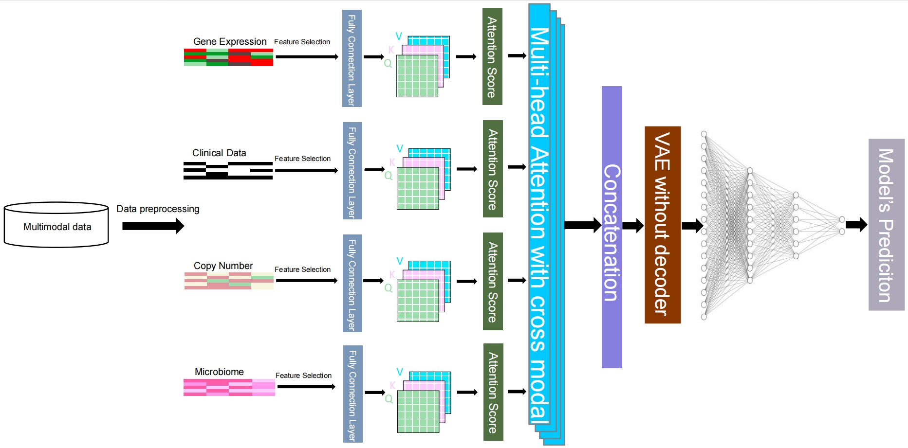

<!-- 标题 -->
### Multimodal attention-based variational autoencoder for clinical risk prediction [[GitHub](https://github.com/wenwenmin/MAVAE)]
### 摘要
Prediction of survival risk in cancer patients is crucial for understanding the underlying mechanisms of canceration in different stages. 
Previous studies mainly relied on single-modal omics data due to  technological constraints. 
However, with the increasing availability of cancer omics data, researchers have focused on the use of multi-omics and multimodal data for survival analysis. 
The application of deep learning methods has become an option for the prediction of clinical risk.
Recent advances in the attention mechanism and the variational autoencoder (VAE) have made them promising for analyzing cancer omics data. 
However, VAE has limitations in disregarding the importance of different features between modalities, and the introduction of an attention mechanism could address this limitation. 
In this study, we propose a Multimodal Attention-based VAE (MAVAE) deep learning framework using cross-modal multihead attention to integrate cancer multi-omics data for clinical risk prediction. 
We evaluated our approach on eight TCGA datasets.
We find that 
(1) MAVAE outperforms traditional machine learning and recent deep learning methods; 
(2) Multi-modal data yields better classification performance than single-modal data; 
(3) The multi-head attention mechanism improves the decision-making process; 
(4) Clinical and genetic data are the most important modal data.
Our implementation of MAVAE is available at \url{https://github.com/wenwenmin/MAVAE}.
<!-- 论文模型图 -->

 

### 论文状态
- BIBM2023 

### 论文引用

The corresponding BiBTeX citation are given below:

<pre>
@inproceedings{li2023multimodal,
  title={Multimodal attention-based variational autoencoder for clinical risk prediction},
  author={Li, Xiaoyu and Xu, Taosheng and Chen, Jinyu and Wan, Jun and Min, Wenwen},
  booktitle={2023 IEEE International Conference on Bioinformatics and Biomedicine (BIBM)},
  pages={1260--1265},
  year={2023},
  organization={IEEE}
}

</pre>

