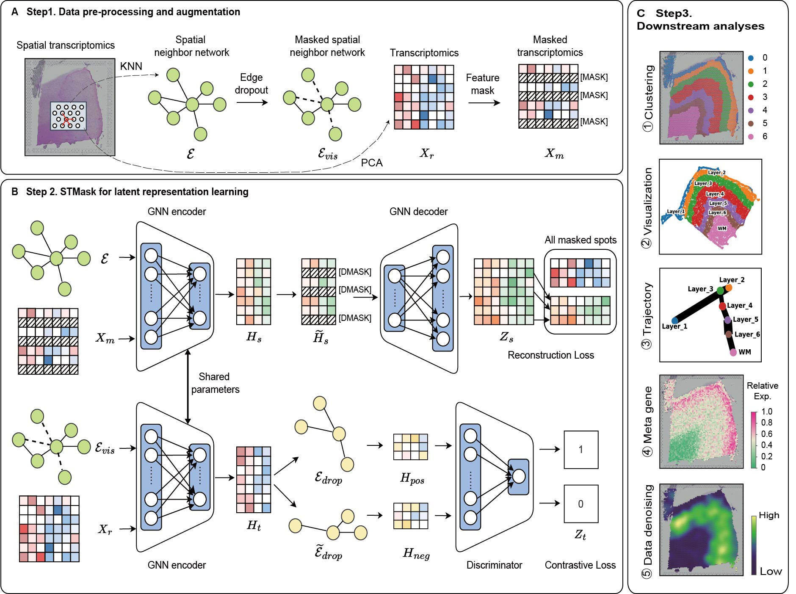

<!-- 标题 -->
### Dimensionality Reduction and Denoising of Spatial Transcriptomics Data Using Dual-channel Masked Graph Auto-encoder [[GitHub](https://github.com/donghaifang/STMask/tree/main)]
### 摘要
We propose an efficient self-supervised learning method utilizing a **dual-channel masked graph autoencoder**  for the analysis and research of spatial transcriptomics data (namely **STMask**). The gene representation learning channel cleverly integrates the masking mechanism into the graph autoencoder, reducing feature redundancy and enhancing model robustness. Additionally, we employ the scaled cosine loss as the training objective to further stabilize the embedding representation. Simultaneously, the gene relationship learning channel disrupts the spatial graph structure to generate multiple perspectives and combines contrastive learning principles to maximize mutual information, thereby strengthening the model's discriminative capability. It is worth noting that the two channels share the same encoder, which helps to enhance the model's ability to learn gene expressions and facilitates the acquisition of discriminative feature embeddings. 
<!-- 论文模型图 -->

 

### 论文状态
- 投稿PLoS CB 2024.5 
- [BioRxiv](https://www.biorxiv.org/content/10.1101/2024.05.30.596562v1)

### 论文引用

The corresponding BiBTeX citation are given below:

<pre>
@article{STMask2024,
author       = {Wenwen Min, Donghai Fang Jinyu Chen and Shihua Zhang},
title        = {Dimensionality Reduction and Denoising of Spatial Transcriptomics Data Using Dual-channel Masked Graph Auto-encoder},
year         = {2024}
}
</pre>

---
title: "STMask"
collection: software
permalink: /software/STMask
date: 2024-06-04
---

<!-- 标题 -->
### Dimensionality Reduction and Denoising of Spatial Transcriptomics Data Using Dual-channel Masked Graph Auto-encoder [[GitHub](https://github.com/donghaifang/STMask/tree/main)]
### 摘要
We propose an efficient self-supervised learning method utilizing a **dual-channel masked graph autoencoder**  for the analysis and research of spatial transcriptomics data (namely **STMask**). The gene representation learning channel cleverly integrates the masking mechanism into the graph autoencoder, reducing feature redundancy and enhancing model robustness. Additionally, we employ the scaled cosine loss as the training objective to further stabilize the embedding representation. Simultaneously, the gene relationship learning channel disrupts the spatial graph structure to generate multiple perspectives and combines contrastive learning principles to maximize mutual information, thereby strengthening the model's discriminative capability. It is worth noting that the two channels share the same encoder, which helps to enhance the model's ability to learn gene expressions and facilitates the acquisition of discriminative feature embeddings. 
<!-- 论文模型图 -->

 

### 论文状态
- 投稿PLoS CB 2024.5 
- [BioRxiv](https://www.biorxiv.org/content/10.1101/2024.05.30.596562v1)

### 论文引用

The corresponding BiBTeX citation are given below:

<pre>
@article{STMask2024,
author       = {Wenwen Min, Donghai Fang Jinyu Chen and Shihua Zhang},
title        = {Dimensionality Reduction and Denoising of Spatial Transcriptomics Data Using Dual-channel Masked Graph Auto-encoder},
year         = {2024}
}
</pre>

